# Capabilidades y uso de la Herramienta/IDE CURSOR


## Casos de Uso

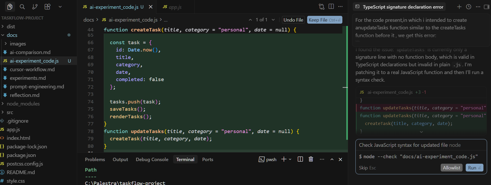
---

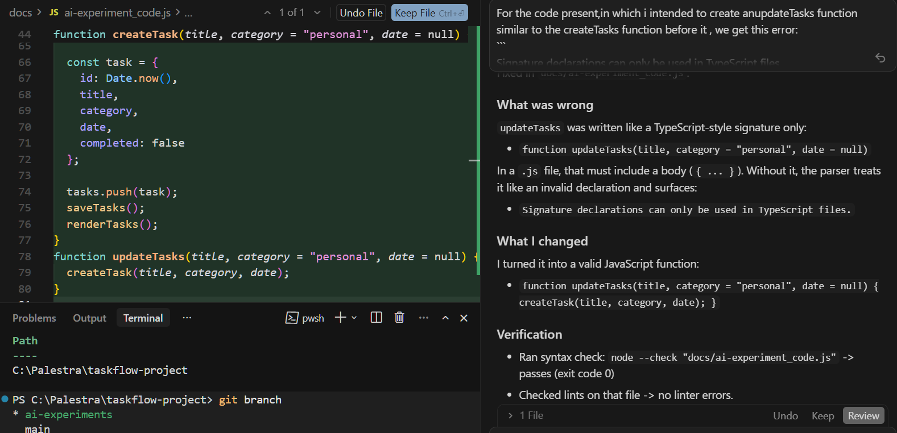
---

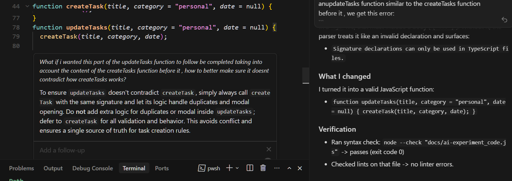
---

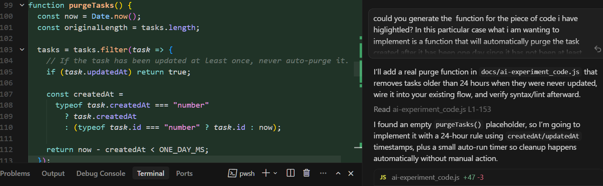
---

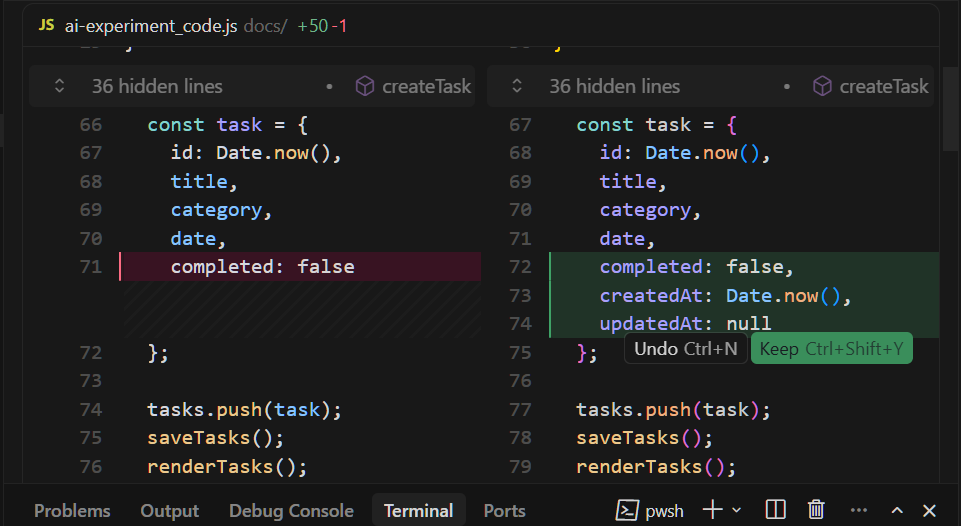
---


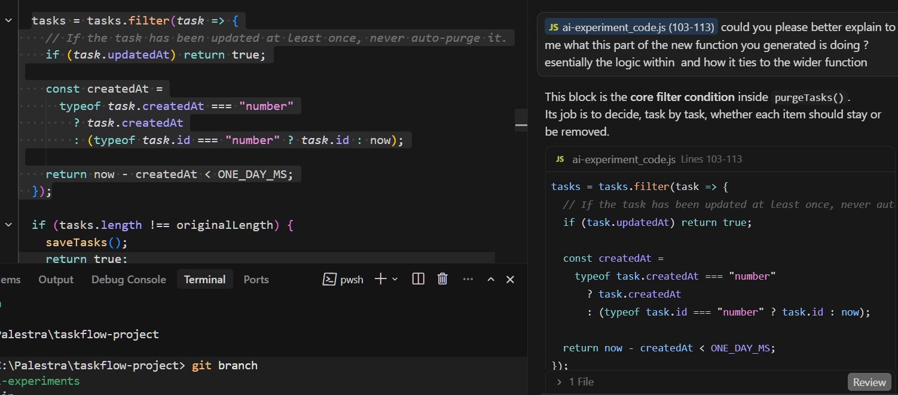
---

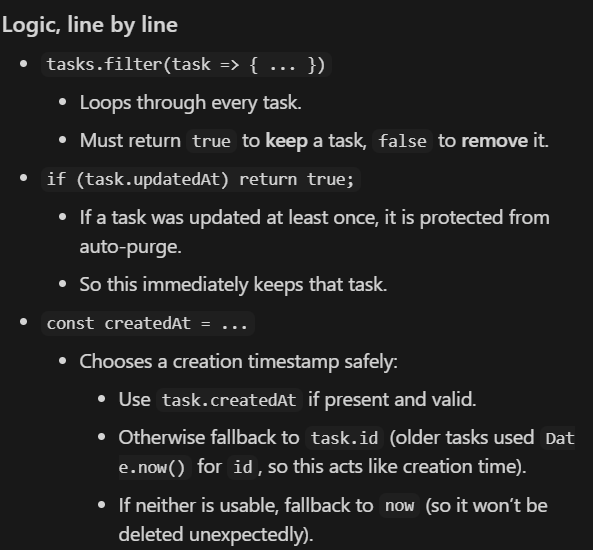
---

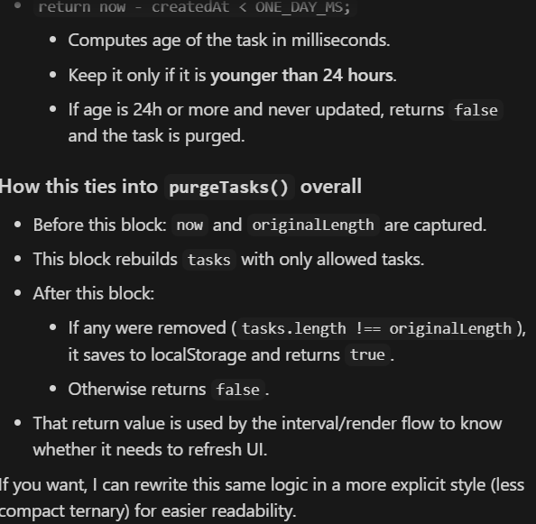
---

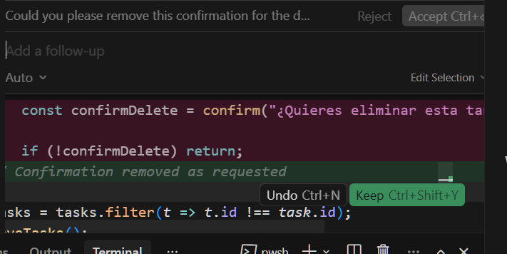
---

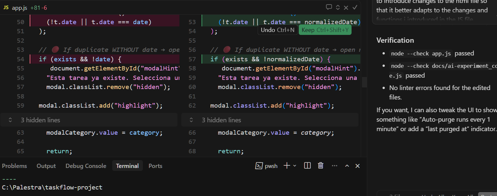
---

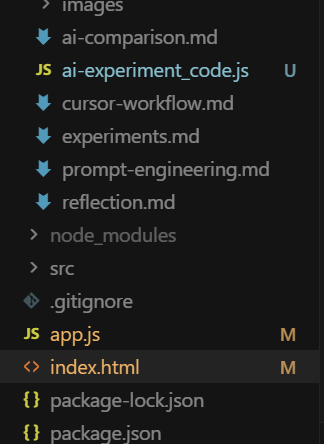
---

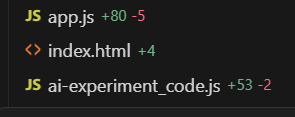
---

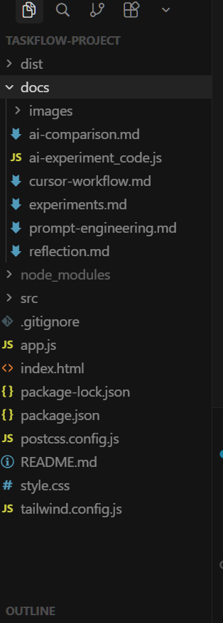


---
---
---

## Refactorizacion de varriables sin alteracion de logica de la aplicacion 

```JS
const els = {
  taskForm: document.getElementById("taskform"),
  taskInput: document.getElementById("task-input"),
  taskList: document.getElementById("tasks"),

  totalTasks: document.getElementById("total-tasks"),
  completedTasks: document.getElementById("completed-tasks"),
  pendingTasks: document.getElementById("pending-tasks"),
  taskCount: document.getElementById("task-count"),

  modal: document.getElementById("taskModal"),
  openModalBtn: document.getElementById("openModal"),
  closeModalBtn: document.getElementById("closeModal"),
  saveTaskBtn: document.getElementById("saveTask"),
  modalHint: document.getElementById("modalHint"),
  modalTitle: document.getElementById("modalTaskTitle"),
  modalCategory: document.getElementById("modalTaskCategory"),
  modalDate: document.getElementById("modalTaskDate"),

  taskTemplate: document.getElementById("task-template"),
  darkToggle: document.getElementById("darkModeToggle"),
};

els.modal.addEventListener("animationend", () => {
  els.modal.classList.remove("highlight");
});

let tasks = [];
let currentFilter = "all"

//Almacenar la tarea
function saveTasks() {
  localStorage.setItem("tasks", JSON.stringify(tasks));
}

function loadTasks() {
  try {
    const data = localStorage.getItem("tasks");
    if (data) {
      tasks = JSON.parse(data);
    }
  } catch (e) {
    console.error("Error loading tasks:", e);
    tasks = [];
  }
}

// Crear tarea
function createTask(title, category = "personal", date = null) {

  const exists = tasks.some(t =>
    t.title.toLowerCase() === title.toLowerCase() &&
    (!t.date || t.date === date)
  );

  // 🔴 If duplicate WITHOUT date → open modal instead
  if (exists && !date) {
    els.modalHint.textContent =
    "Esta tarea ya existe. Selecciona una fecha diferente.";
    els.modal.classList.remove("hidden");

    els.modal.classList.add("highlight");

    // Pre-fill modal
    els.modalTitle.value = title;
    els.modalCategory.value = category;

    return;
  }

  const task = {
    id: Date.now(),
    title,
    category,
    date,
    completed: false
  };

  tasks.push(task);
  saveTasks();
  renderTasks();
}

// Renderizar las  tareas creadas

function renderTasks() {
  els.taskList.innerHTML = "";

  // 1. START from real state
  let filtered = [...tasks];

  // 2. APPLY filter FIRST
  if (currentFilter === "completed") {
    filtered = filtered.filter(t => t.completed);
  } else if (currentFilter === "pending") {
    filtered = filtered.filter(t => !t.completed);
  }

  // 3. HANDLE EMPTY STATE AFTER filtering
  if (filtered.length === 0) {
    els.taskList.innerHTML = `
      <div class="empty-state">
        <p>No tienes tareas aún</p>
        <small>Añade una nueva tarea para comenzar</small>
      </div>
    `;
    updateStats();
    return;
  }

  // 4. RENDER CLEANLY
  filtered.forEach(task => {
    const clone = els.taskTemplate.content.cloneNode(true);

    const checkbox = clone.querySelector(".task-checkbox");
    const title = clone.querySelector(".task-title");
    const meta = clone.querySelector(".task-meta");
    const deleteBtn = clone.querySelector(".delete-task");

    title.textContent = task.title;

    let metaText = task.category;
    if (task.date) {
      metaText += ` - ${task.date}`;
    }
    meta.textContent = metaText;

    checkbox.checked = task.completed;

    checkbox.addEventListener("change", () => {
      task.completed = checkbox.checked;
      saveTasks();
      renderTasks();
    });

  deleteBtn.addEventListener("click", () => {
  const confirmDelete = confirm("¿Quieres eliminar esta tarea?");

  if (!confirmDelete) return;

  tasks = tasks.filter(t => t.id !== task.id);
  saveTasks();
  renderTasks();
});

    els.taskList.appendChild(clone);
  });

  updateStats();
}

//-Filtro de tareas
document.querySelectorAll("[data-filter]").forEach(btn => {
  btn.addEventListener("click", () => {
    document.querySelectorAll("[data-filter]").forEach(b => b.classList.remove("active-filter"));
    btn.classList.add("active-filter");

    currentFilter = btn.dataset.filter;
    renderTasks();
  });
});

//Aplicacion de la clase Modal

els.openModalBtn.addEventListener("click", (e) => {
  e.preventDefault();
  els.modal.classList.remove("hidden");
});

els.closeModalBtn.addEventListener("click", () => {
  els.modal.classList.add("hidden");
  els.modalHint.textContent = "";
});

els.saveTaskBtn.addEventListener("click", () => {
  const title = els.modalTitle.value.trim();
  if (!title) return;

  createTask(title, els.modalCategory.value, els.modalDate.value);

  els.modal.classList.add("hidden");

  els.modalTitle.value = "";
  els.modalDate.value = "";
  els.modalHint.textContent = ""; 
});


//Funcionalidad de estadisticas
function updateStats() {
  els.taskCount.textContent = `${tasks.length} tareas`;
  const total = tasks.length;
  const completed = tasks.filter(t => t.completed).length;
  const pending = total - completed;

  els.totalTasks.textContent = total;
  els.completedTasks.textContent = completed;
  els.pendingTasks.textContent = pending;
}


//Formulario

els.taskForm.addEventListener("submit", (e) => {
  e.preventDefault();

  const title = els.taskInput.value.trim();
  if (!title) return;

  createTask(title);
  els.taskInput.value = "";
});

function setIcon(isDark) {
  els.darkToggle.innerHTML = isDark
    ? '<i data-lucide="sun"></i>'
    : '<i data-lucide="moon"></i>';

  lucide.createIcons();
}

els.darkToggle.addEventListener("click", () => {
  document.body.classList.toggle("dark-mode");

  const isDark = document.body.classList.contains("dark-mode");
  localStorage.setItem("darkMode", isDark);

  setIcon(isDark);
});

// Load saved mode
const savedMode = localStorage.getItem("darkMode");

if (savedMode === "true") {
  document.body.classList.add("dark-mode");
}

// Set correct icon on load
setIcon(document.body.classList.contains("dark-mode"));

loadTasks();
renderTasks();   

```

La funcionalidad de la app es exactamente la misma apero se añade una clase extra "els" con el fin de añadir consistencia y facilitar la agrupacion de variables en el DOM sin que parezca que son de aparicion espontanea.

## Prompt y respuesta  sugiriendo sobre la posibilidad de mejorar aspectos especificos de la programaicion de la app

### Prompt

Is there any part in the whole piece of js code  you just refactored that you think could be at slightly improved upon?

### Respuesta

Yes — a few small improvements would make it sturdier
Null-safety for els: if an id changes in index.html, els.something becomes null and you’ll crash at first use. Add a quick check once after building els (log missing keys).

Avoid repeated DOM queries: you still do document.querySelectorAll("[data-filter]") twice in the filter handler. Cache it once (or use event delegation on the parent .filters).

Normalize modal date value: modalDate.value is "" when empty; you currently store that directly as date. Converting "" → null avoids edge cases in your duplicate detection and display.

Rendering performance (minor): renderTasks() wipes and rebuilds the full list on any change. For small lists it’s fine; for bigger lists you could update only the changed item (or at least build into a DocumentFragment before appending).

Consistency: add the missing semicolon after let currentFilter = "all" (you’re mostly using semicolons elsewhere).

## Caso de modificacion de estructura de ficheros del proyecto con cambio de archivos y variables


---

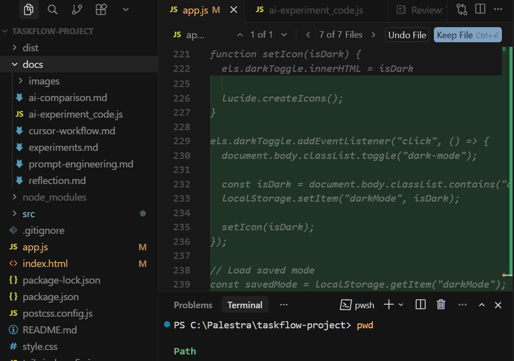
---

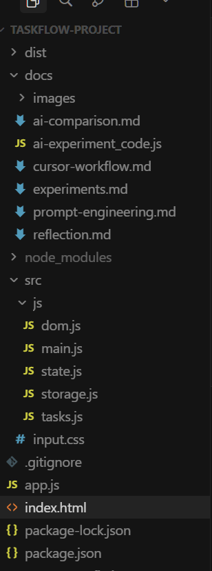
---

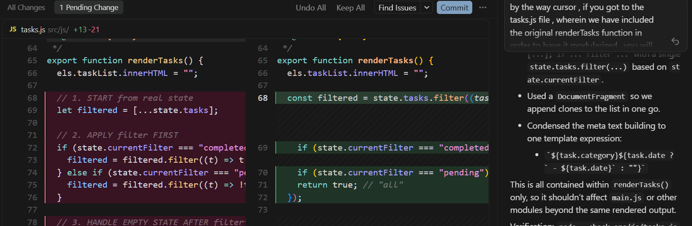
---

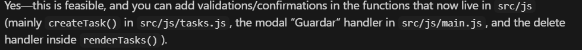
---

## Añadido de estructura de validaciones/confirmaciones adicionales , con uso de omentarios segun formato requerido

```JS

window.TaskFlow = window.TaskFlow || {};

const els = window.TaskFlow.els;
const state = window.TaskFlow.state;
const saveTasks = window.TaskFlow.saveTasks;

let pendingDeleteId = null;

const confirmDeleteAvailable = Boolean(
  els &&
    els.confirmDeleteModal &&
    els.confirmDeleteText &&
    els.confirmDeleteCancelBtn &&
    els.confirmDeleteOkBtn
);

/**
 * Show validation feedback.
 * If the details modal is open, write into it; otherwise fall back to alert().
 * @param {string} message
 */
function showUserError(message) {
  if (els && els.modal && !els.modal.classList.contains("hidden")) {
    els.modalHint.textContent = message;
    els.modal.classList.add("highlight");
    return;
  }
  alert(message);
}
```

## Ejemplo  concreto de simplificacion de funcion 

```JS
window.TaskFlow.loadTasks = function loadTasks() {
  try {
    const data = localStorage.getItem("tasks");
    if (data) {
      window.TaskFlow.state.tasks = JSON.parse(data);
    }
  } catch (e) {
    console.error("Error loading tasks:", e);
    window.TaskFlow.state.tasks = [];
  }
};

```